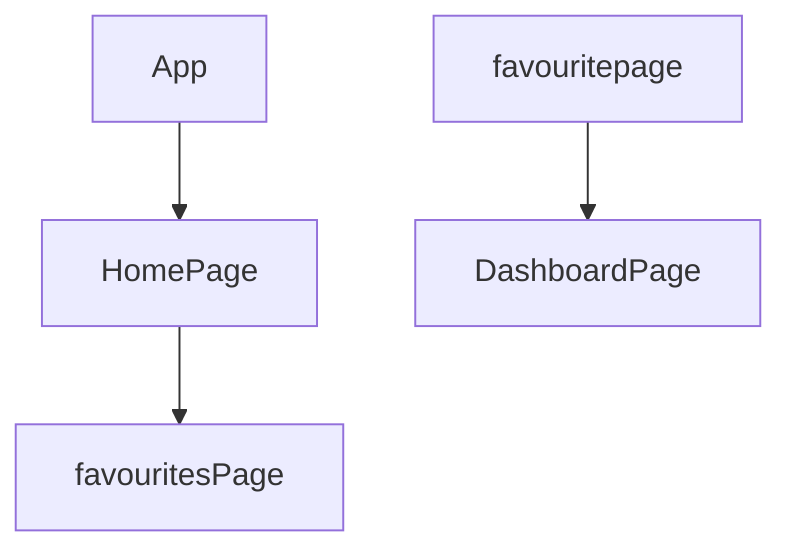

> 💻 PROJECT NAME ✨ => 💻  Betalatics-assign
> 
 

## 🔗 Profile Links✨

| Resume | Github                                                                                                                                   | Linkedin                                                                                                                                                            | Portfolio                                                                                                                                    | Blogger                                                                                                                                                           | Medium                                                                                                                                    |
| ------------- | ---------------------------------------------------------------------------------------------------------------------------------------- | ------------------------------------------------------------------------------------------------------------------------------------------------------------------- | -------------------------------------------------------------------------------------------------------------------------------------------- | -------------------------------------------------------------------------------------------------------------------------------------------- | -------------------------------------------------------------------------------------------------------------------------------------------- |
|  | |  | | | |  

## 💫Tech-Stack->

- #### For Frontend:-
   - `HTML5`
  - `CSS3`
  - `JavaScript `
  - `ReactJS`
  - `ReactJS`

- #### For Styling:-  
   - `Tailwind css `
  
- #### For live Project: -
   - `Vercel`
   

## ⭕Steps to run our project:

✨Clone the repository.

✨Run the command `npm install` in both the frontend and backend folders.

✨Run the command `npm start` in the frontend folder on localhost:3000.

---
## Features ✨:-
---
 | Serial No            | Feature                                                              |
| ----------------- | ------------------------
| 1 | User login,  upload profile page|
| 2 | Home Page Design, responsive design |
| 3 |Create Project, Show Project list  |
| 4 | Upload Project, Edit & delete Project|
| 5 | Dashboard page general & display  |

---
# Package.json(Dependency)✨:-

 | Serial No  | Frontend |
| -----------------|-----|
| 1 | Tailwind css |
| 2 |  React Router dom |
| 3 | react-icons |
| 4 | typescript |
| 5 |  react |

⭕Steps to use our project:
---

Betalatics  Application lets you  add favourites, show a favourite list, search for npm packages and update, and delete favourites.

---✨Getting Started:

✨Initialize the Application: To begin using the application, navigate to the frontend terminal and execute the command npm start. This will start the application locally, making it accessible through your web browser at port 3000.

✨Home Page: Upon launching the application, users are greeted with the home page, offering essential options for interaction like the add favourites button.

---✨User Journey:

✨Add favourites: Following a successful visit, users are taken to the Create Favorites page.

✨Show Favorites List: Once the favourites setup is complete, users can click on any favourite table to go to the view favourites popup. 

✨Search  the npm package:  by query and favourites comment.

✨Edit and delete favourite data.

---

## Flow

---

<h1 align="center">✨Thank You✨</h1>

